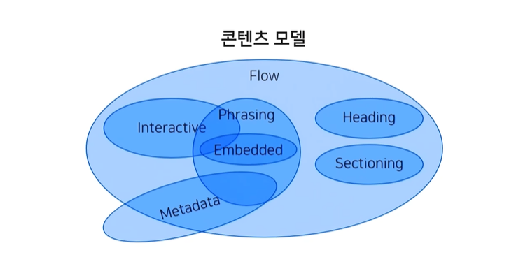

# Content Model

**Content Model** 

+ HTML 요소들이 가지고 있는 성격에 따라 **요소의 종류를 정의하는 규칙들을 그룹화** 시켜놓은 것.
+ 각 HTML 요소는 하나 또는 여러 개의 콘텐츠 모델에 속하며, 비슷한 성격의 요소끼리 그룹화됨

+ ## Metadata

  + 콘텐츠의 style(표현), script(동작)을 설정하거나 다른 문서와의 관계 등의 정보를 포함하는 요소들

  + 대부분 `head` 태그 내에 들어간다는  특징을 가짐
  + base, link, meta, noscript, script, style, title

+ ## Flow

  + 문서의 자연스러운 흐름에 의해 배치되는 요소
  + 문서에 사용되는 대부분의 요소가 해당되고, 일부 Metadata 태그들만 제외됨
  + a, abbr, address, map, area, article, aside, audio, b, bdo, blockquote,br, button, canvas, cite, code, datalist, del, details, dfn, div, dl, em, embed, fieldset, figure, footer, form, h1 ~ h6, header, hgroup, hr, i, iframe, img, input, ins, kbd, keygen, label, map, mark, math, menu, meter, nav, noscript, object, ol,
    output, p, pre, progress, q, ruby, samp, script, section, select, small, span, strong, style[scoped], sub, sup, svg, table, textarea, time, ul, var, video, wbr

+ ## Sectioning

  + 문서의 구조와 관련된 요소들
  + 문서의 구조, 아웃라인에 영향을 주는 태그들
  + HTML5에서 새로 생긴 article, aside, nav, section

+ ## Heading

  + 각 section의 header를 정의하는 요소들
  + 제목 태그 h1, h2, h3, h4, h5, h6

+ ## Phrasing

  + 문서의 텍스트 또는 텍스트를 꾸미는 문단 내부 레벨로 사용되는 요소들
  + a, abbr, map, area, audio, b, bdo, br, button, canvas, cite, code, datalist, del, dfn, em, embed, i, iframe, img, input, ins, kbd, keygen, label, map, mark, math, meter, noscript, object, output, progress, q, ruby, samp, script, select, small, span, strong, sub, sup, svg, textarea, time, var, video, wbr

+ ## Embedded

  + 외부 콘텐츠를 표현하는 요소들. 주로 멀티미디어 관련 요소들.
  + audio, canvas, embed, iframe, img, math, object, svg, video

+ ## Interactive

  + 사용자와 상호작용을 하는 요소들 (대표적으로 폼 요소)
  + a, audio[controls], button, details, embed, iframe, img[usemap], input, keygen, label, menu,
    object[usemap], select, textarea, video[controls]

