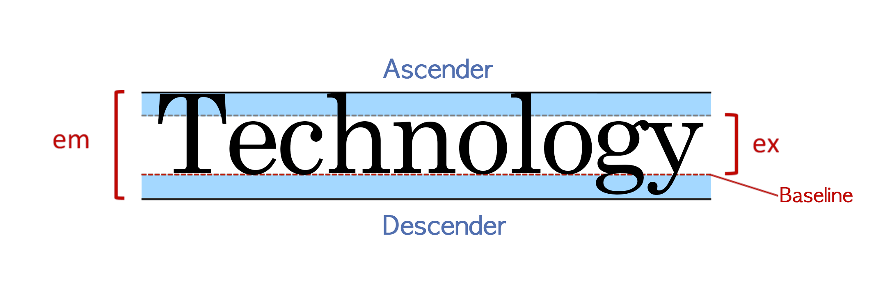

# Typography 타이포그래피

+ **ex** : 소문자 x의 높이
+ **em** : 폰트의 전체 높이
+ **Baseline** : 소문자 x 기준 하단 라인
+ **Descender** : g, j, p, q, y와 같이, 소문자 x의 하단 라인, baseline 아래로 넘어가는 영역. 서체에 따라 이 길이가 달라진다.
+ **Ascender** : b, d, h, l과 같이 소문자 x의 상단 라인 위로 넘어가는 영역

