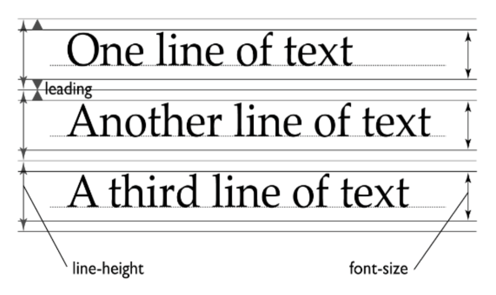
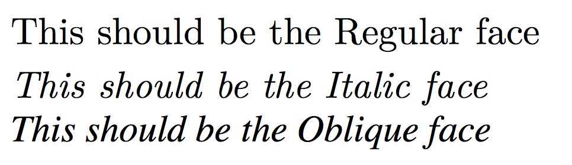

# font 폰트


## font-family

+ 사용할 폰트를 지정하는 속성

  

```css
font-family : family-name | generic-family ( | initial | inherit );
```

+ **family-name** : 사용할 폰트의 이름. ',' 반점으로 구분하여 여러 개를 선언할 수 있고, 선언한 순서대로 적용 우선순위가 결정된다. 이름에 공백이 있거나 한글인 경우, 홑따옴표로 묶어서 선언한다.
+ **generic-family** : family-name으로 지정된 폰트를 사용할 수 없는 경우를 대비하여, 대체할 수 있는 폰트를 지정한다. font-family 속성의 맨 마지막에 선언한다.
  + 대표적인 generic-family에는 글자 획에 삐침이 있는 serif(ex. 명조체), 획에 삐침이 없는 sans-serif(ex. 돋움체)가 있다.


> 💡
>
> + font-family는 상속되기 때문에, 기본적으로 body에 대표 폰트를 선언하고, 특정 폰트가 필요한 부분에서 재정의하여 사용한다.
> + 자식 요소에서 font-family를 재선언하는 경우, 부모에 generic-family가 선언되어 있어도, 다시 선언해야한다.


```CSS
font-family: Helvetica, Dotum, '돋움', Apple SD Gothic Neo, sans-serif; 
```

+ "abc"와 "123" 같은 영어와 숫자는 가장 먼저 선언된 Helvetica로 적용된다. Helvetica는 한글을 지원하지 않으므로, "가나다"와 같은 한글은 다음에 선언된 Dotum으로 적용된다.

+ 한글을 지원하지 않는 디바이스는 한글 폰트를 불러올 수 없으므로, **한글 폰트를 영문명으로도 선언해 주어야 한다.** 💡


## font-size

+ **글꼴의 크기**를 지정하는 속성

```CSS
font-size: keyword | length | initial | inherit ;
```

+ 속성값

  + **default : medium** (기본 값 미지정 시 글꼴의 기본 크기는 16px, 1em)

  + **keyword** → 실무에서 많이 사용 안 함

    + **absolute size** : 기본 값인 medium에 대한 상대적인 크기로, 브라우저마다 다르게 정의되어있음. 

      ​	medium, xx-small, x-small, small, large, x-large, x-large, xx-large

    + **relative size** : 부모 요소 font-size를 기준으로 정의

      ​	smaller(부모 요소 font-size 0.8배), larger(부모 요소 font-size 1.2배)

  + **length** : px, em, rem 등의 단위를 이용한 고정 수치.

    + **em** : 문자 중심 속성이므로 부모 요소 font-size * em 값 (ref. [길이 단위 정리 내용](../5. 단위, 배경, 박스모델/5-1_길이 단위.md))
    + **rem** : 루트 요소 font-size *  rem 값

  + **% percent** : 부모 요소의 font-size를 기준으로 백분율 계산 값

  + viewport units : view port 사이즈를 기준으로 하는 유동적인 수치

    + **vw** : 뷰포트 width의 1%
    + **vh** : 뷰포트 height의 1%


## line-height

+ **텍스트 라인의 높이**를 의미함. 주로 **행간을 제어**할 때 사용됨
+ **타이포그래피 구조의 em 높이 + 상하단의 여백**을 의미함.
+ line-height로 제어되는 부분을 **line-box**라고도 함.
  * 윗줄 텍스트 하단과 아랫줄 텍스트 상단 간의 간격을 **leading**이라고 함.
+ **단위가 없는 숫자를 속성값으로 줄 수 있다는 특징**을 가짐



```css
line-height: normal | number | length | initial | inherit ;
```

+ 속성값
  + **default : normal**
  + **normal** : 기본값, 브라우저 기본 속성을 따름. 폰트와 브라우저에 따라 다르지면 보통 1.2 정도
  + **number** : font-size를 기준으로 설정한 숫자만큼 배율로 적용
  + **% percent** : font-size를 기준으로 설정한 퍼센트만큼 배율로 적용
  + **length** : px, em 등 고정 수치로 할당


> 💡
>
> + 행간의 상하단 여백을 나누어 넣는 방식은 브라우저마다 다르다.
>
> * number와 % percent 선언의 차이점은 자식 요소로 상속되었을 때 계산방식에서 나타남.
>   * numer는 부모 요소에서 선언된 숫자 값이 그대로 상속되어, 자식 요소에서는 자식 요소의 font-size를 기준으로 계산한 값을 line-height에 적용함.
>   * % percent는 부모 요소에서 % 값에 의해 이미 계산된 px 단위의 값이 자식 요소로 상속됨.

```css
body { font-size: 20px; line-height: 2; }    /* line-height = 40px; */
p { font-size: 10px; }                       /* line-height = 20px; */


body { font-size: 20px; line-height: 200%; }    /* line-height = 40px; */
p { font-size: 10px; }                          /* line-height = 40px; */
```


## font-weight

+ 글꼴의 굵기를 지정하는 속성

```css
font-weight: normal | bold | bolder | lighter | number | initial | inherit ;
```

+ 속성값
  + **default : normal**
  + **normal** : 기본 값(400)
  + **bold** : 굵게 (700)
  + **bolder** : 부모 요소보다  굵게
  + **lighter** : 부모 요소보다 얇게
  + **number** : 100, 200, 300, ... 900의 100 단위로, 값이 클수록 굵게 표현

> 💡
>
> + **실무에서는 normal과 bold를 많이 사용**하고 부모 요소의 영향을 받는 **bolder, lighter 사용은 지양**하는 편.
>
> + **수치(number)를 이용한 속성값 지정은 폰트 자체에서 지원을 해야 표현할 수 있음.** 폰트에 따라 weight를 지정해도 굵기 변화가 없을 수 있음.
>
>   normal과 bold만 지원하는 폰트도 있고, 이 경우 100~500은 normal, 600~900은 bold로 표현함.


## font-style

+ 글꼴의 스타일을 지정하는 속성

```css
font-style: normal | italic | oblique | initial | inherit;
```




+ 속성값
  + **default : normal** 
  + **normal** : font-family 내에 분류된 기본값
  + **italic** : italic 스타일 (약간 기울어짐, `<em>` 태그에 적용되는 스타일)
  + **oblique** <각도> : oblique 스타일 
    + 각도의 유효한 값은 -90 ~ 90도. **각도 미지정 시 14도**로 적용됨. **각도 지정은 CSS Fonts Module Level 4를 지원하는 브라우저에서만 사용 가능**


## font-variant

+ **글꼴의 형태를 변형**하는 속성
+ 소문자를 작은 대문자로 변형할 수 있음

```css
font-variant: normal | small-caps | initial | inherit;
```

+ 속성값
  + default : normal
  + normal : 변형 없음
  + **small-caps** : 소문자를 작은 대문자(실제 대문자 사이즈보다 작은 사이즈) 형태로 변형


## font

+ **font 관련 속성**들을 한번에 선언하는 축약형 속성
  + **font-size와 font-family는 필수**로 선언.
  + 선언 순서를 지켜야함
  + 빠진 속성은 기본값을 지정됨.
  + 위와 같이 **지켜야 하는 제한이 있고, 가독성이 좋지 않아 실무에서는 지양하는 편**

```css
font: font-style font-variant font-weight font-size/line-height font-family | initial | inherit;

/* 사용 예시
style | variant | weight | size/line-height | family 
*/
font: oblique small-caps bold 16px/1.5 '돋움';
```

+ 속성값 default : 각 속성의 default 값


## @font-face 웹 폰트

+ **웹에 있는 글꼴을 사용자의 로컬 환경(컴퓨터)에 다운로드하여 적용하는 속성**

```css
@font-face { 
    font-properties 
}
```

+ 속성값
  + font-family : 필수. 글꼴의 이름 지정
  + src : 필수. 다운로드 받을 글꼴의 경로 (URL)
  + font-style : 옵션. 글꼴의 스타일 지정 (기본값 normal)
  + font-weight : 옵션. 글꼴의 굵기 지정 (기본값 normal)


+ 폰트 파일 자체를 웹에서 제공하기 때문에, 여러 브라우저에서 나올 수 있도록 여러 폰트 파일을 제공해야 함.
+ 웹 폰트의 경우, generic-family를 src에서 다 제공하고 있어야하기 때문에, generic-family를 따로 선언하지 않을 수 있음


```css
/* 사용 예시 */

@font-face {
    font-family: webNanumGothic; /* (필수) 폰트 이름 지정 */
    src: url(NanumGothic.eot); /* (필수) 다운로드 받은 폰트 경로, URL */
    font-weight: bold; /* (옵션) 글꼴 굵기 지정, 기본 값은 normal */
    font-style: italic; /* (옵션) 글꼴 스타일 지정, 기본 값은 normal */
}

body {
    font-family: webNanumGothic;
}
```


> 💡 **실무에서 폰트와 관련하여 주로 사용되는 명칭들**
>
> + **시스템 폰트** : font-family로 선언한 글꼴이, 사용자 시스템에 기본으로 설치되어 있어 사용할 수 있는 경우.
>
> + **이미지 폰트** : 다양한 시각적 요소를 반영하기 위해, 글꼴 대신 이미지를 사용하는 경우.
>
>   용량이 크고 텍스트 수정이 필요한 경우, 이미지 자체 수정이 필요한 단점이 있음.
>
> + 웹 폰트 : 웹 서버에 있는 폰트를 사용자 로컬 환경에 다운로드하여 불러와 적용하는 경우.

